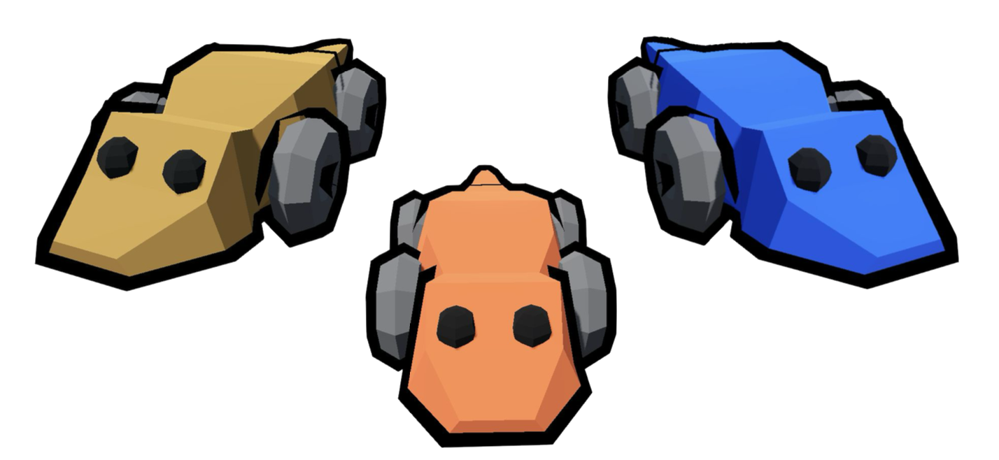

# [CMCS 23/24]Uta Stansburiana Sillycon Desert

This repository contains the final project for the "Complex Models for Complex Systems" course held at the University of Pisa.

## Project Description
The project focuses on implementing a real-time simulation of a population of Uta stansburiana, a species of side-blotched
lizard known for the unique mating strategies of its three male morphs, which follows a Rock-Paper-Scissors dynamic.

## Implementation
The project is implemented using the Godot Engine.
